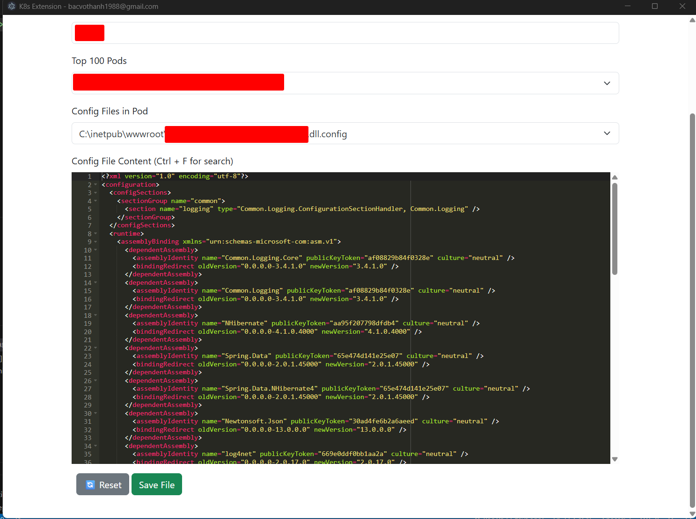

# 🔧 K8s Config Editor - Electron Desktop App

A lightweight desktop tool built with Electron to browse, edit, and sync `.config` files inside Kubernetes pods with a simple and user-friendly interface.



---

## ✨ Features

- ✅ Load and filter **namespaces** and **pods**
- ✅ Filter pods using **prefix**
- ✅ List all `.config` files inside selected pods
- ✅ Edit file content using a modern code editor with **syntax highlighting** and **search**

---

## 🖥️ Requirements

- Node.js >= 18
- Git
- PowerShell (on Windows)
- `kubectl` installed and configured (`kubeconfig` ready)

---

## 🚀 Run Locally

```bash
git clone https://github.com/your-org/k8s-config-editor.git
cd k8s-config-editor
npm install
npm run dev
